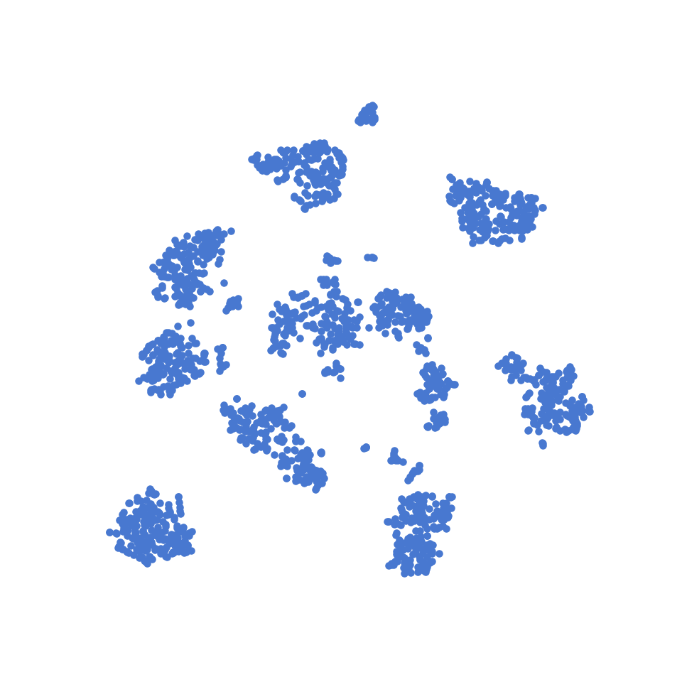
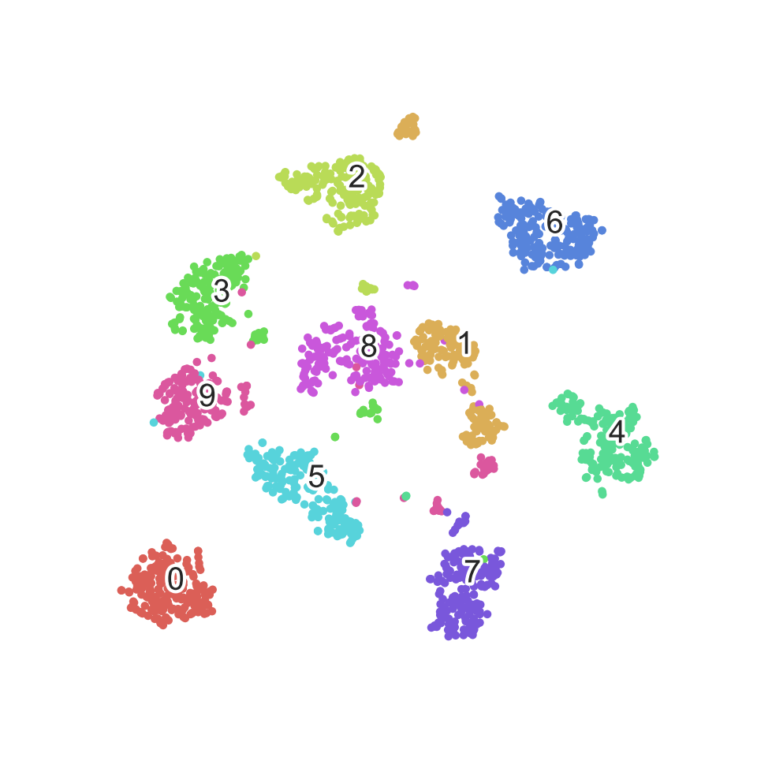
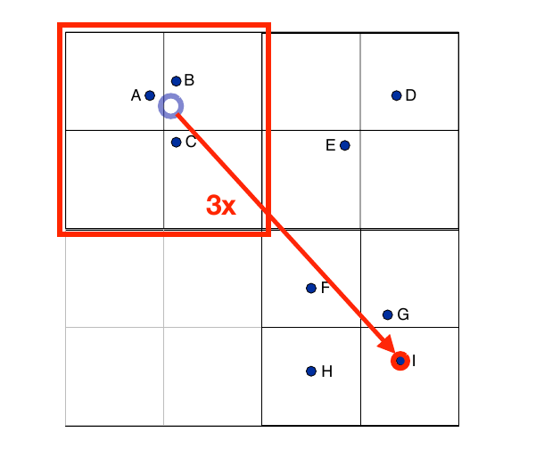
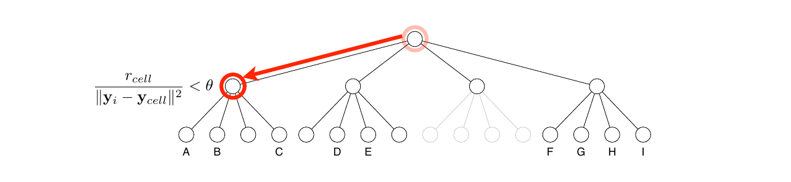
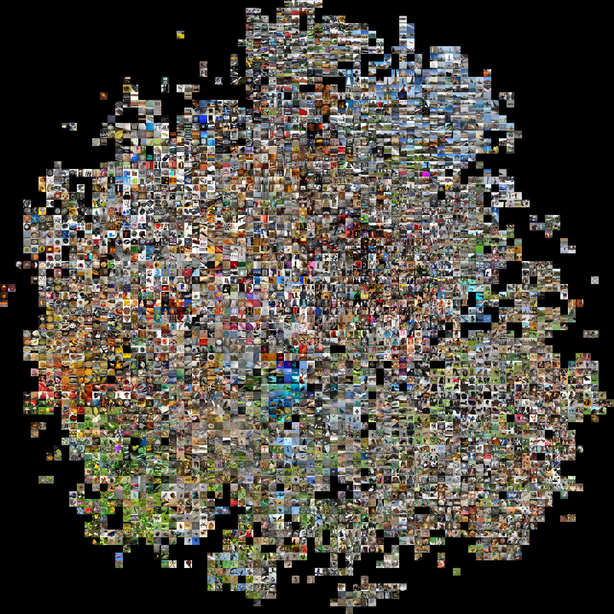

## {.title-slide}

<style>
.reveal h1, .reveal h2 {
    font-family: auto;    
    text-transform: none;
}

.author {
    text-align: right;
}

.date {
    font-family: auto !important;
    text-transform: none !important;
    font-size: 1em !important;
    text-align: right;
}

li {
    margin-top: 1rem !important;
}    
    
.normaltext p, .normaltext li {
    font-size: 25pt !important;
    line-height: 25pt !important;
  }

.smalltext p, .smalltext li {
    font-size: 20pt !important;
    line-height: 20pt !important;
  }

.tinytext {
    display: block;
    font-size: 1rem !important;
    text-align: right;
    }
    
.jumbotron {
    text-align: justify !important;
    background: #444 !important;
    padding: 5px 50px !important;
    border-radius: 10px !important;
    border: 2px solid !important;
}

.author-details h1 {
 margin-bottom: 5rem !important;
}

.author-details p {
 text-align: right !important;
 margin: 0 !important;
}

</style>

<div class="author-details">
<h1>t-SNE: A way to Visualize Multidimensional Dataset</h1>

Subhrajyoty Roy

**Mentor: ** Dr. Ayanendranath Basu, ISRU

**Date: ** 13th December, 2019

</div>


## Introduction { .normaltext}

- t-SNE ([t distributed Stochastic Neighbour Embedding](https://lvdmaaten.github.io/tsne/){target="_blank"}) is an unsupervised non-linear projection / dimension reduction technique. 

- Greatly used for visualizing multidimensional data nowadays, i.e. projecting hundreds of dimensions only to 2D or 3D, so that some pattern persists.

- t-SNE has been used for visualization in a wide range of applications, including computer security research, music analysis, text analysis, cancer research, bioinformatics and biomedical signal processing.

## t-SNE on MNIST dataset {.normaltext}

Let's first look at how t-SNE performs on [MNIST](https://en.wikipedia.org/wiki/MNIST_database){target="_blank"} dataset.


  - 60,000 handwritten digits from 0 to 9.
  - Black & White 28x28 images.
  - Represented by 784 dimensional vectors.


## t-SNE on MNIST dataset (Contd.) {.smalltext}

Due to limited resource, tSNE is applied on a random subset of MNIST dataset, having only 6000 samples. Without any supervised information about the actual digits, from the vectors alone it learned some clusters in the dataset. 



[Let's add colors corresponding to different digits](javascript:void(0)).


## t-SNE on MNIST dataset (Contd.) { .normaltext}

t-SNE can identify the clusters in unsupervised way and can project the 784 dimensional data only onto 2 dimensions retaining the structure. 




## Problem Formalization {.normaltext}

- We have a dataset $X_1, X_2, \dots X_n$ where each $X_i \in \mathbb{R}^d$ where $d$ is considerably high. It is often the case that these datapoints, actually lie in a lower dimensional manifold. These $X_i$'s are elements of feature space (input space).

- We want to have their representations $Y_1, Y_2, \dots Y_n$ where each $Y_i \in \mathbb{R}^p$, where $p$ usually is 2 or 3 (since we want to visualize). This $Y_i$'s are elements of the embedded space.

- $X_i$ and $Y_i$ should be related in some way, so that $Y_i$ is a very accurate representation of $X_i$ in terms of its position in the manifold.

## What is a good representative? {.normaltext}

Euclidean distance vs The distance through the manifold.

```{r echo = FALSE, fig.width=10, fig.height=5}
par(mfrow = c(1, 2))

set.seed(1234)
phi = runif(100, min = 1.5*pi, max = 4.5*pi)
phi = sort(phi)
x = phi * sin(phi)/20
y = phi * cos(phi)/100
cols = rep(RColorBrewer::brewer.pal(10, "Spectral"), each = 10)
plot(x, y, pch = 21, main = "2D Swiss Roll", bg = rev(cols), cex = 1.5, col = "black")
points(x[c(7, 84)], y[c(7, 84)], lty = 2, type = "b", cex = 3)

pca <- prcomp(cbind(x, y))
plot(pca$x[, 1], runif(100)/10, ylim = c(-0.5,0.5), main = "1D PCA", xlab = "1st Comp", ylab = "Just Random noise", pch = 21, bg = rev(cols), cex = 1.5, col = "black")

```


## What is a good representative? {.normaltext}

Ideal visualization would be;

```{r echo = FALSE, fig.height=4}
a <- (phi * sqrt(phi^2 + 1) + asinh(phi))

plot(a/60 - 2, rep(0, 100), ylim = c(-0.5,0.5), main = "1D Ideal", xlab = "Ideal Comp", ylab = "", pch = 21, bg = rev(cols), cex = 1.5, col = "black")
```

[Idea](javascript:void(0)) is to preserve the local distances, but not the global ones.


## Stochastic Neighbour Embedding {.smalltext}

- For each datapoint $X_i$, define $$p_{j|i} \propto \exp\left( -\frac{\Vert X_i - X_j\Vert^2}{2\sigma_i^2} \right) \quad \forall j = 1, 2, \dots n; j\neq i$$

- Define $p_{i|i} = 0 \quad \forall i = 1, 2, \dots n$.

- $p_{j|i}$ can be interpreted as the likelihood that datapoint $X_i$ would pick datapoint $X_j$ as its neighbours if neighbours are picked according to a Gaussian distribution centered at $X_i$.

- Even if all variables are not quantitative, as long as a similarity between two datapoints can be defined, they can be scaled to obtain $p_{j|i}$.

- Note that $p_{i|j}$ and $p_{j | i}$ are different because of different normalization factors.


## Stochastic Neighbour Embedding {.smalltext}

- Similarly define $q_{j|i}$ as the analogus probabilistic similarities in embedded space. 

$$q_{j|i} \propto  \exp\left( -\Vert Y_i - Y_j\Vert^2 \right) \quad \forall j = 1, 2, \dots n; j\neq i$$

- Note that, $\sigma_i$'s are different in feature space for each datapoint $X_i$. This is chosen such that, for each datapoint $X_i$, the ball centered at $X_i$ of radius $\sigma_i$ contains approximately same number of other datapoints. This is obtained through fixing the [Perplexity](https://en.wikipedia.org/wiki/Perplexity){target="_blank"} of the Gaussian distributions to a fixed quantity.

- Intuitively, for dense regions in feature space, we set low $\sigma_i$, and for sparse regions we set high $\sigma_i$.

## Stochastic Neighbour Embedding {.smalltext}

- If $Y_i$'s accurately represents its higher dimensional analogue $X_i$, then; $$P_i = \left( p_{1|i}, \dots p_{(i-1)|i}, p_{(i+1)|i}, \dots p_{n|i} \right) \\\approx \left( q_{1|i}, \dots q_{(i-1)|i}, q_{(i+1)|i}, \dots q_{n|i} \right) = Q_i$$

- So, we can wish to minimize Kullback-Leibler divergence between $P_i$ and $Q_i$ for each datapoint $X_i$.

- Consequently, we wish to minimize, 
$$C = \sum_{i = 1}^{n} KL\left( P_i \Vert Q_i \right) = \sum_i\sum_j p_{j|i}\log\left(\frac{p_{j|i}}{q_{j|i}}\right)$$
with respect to $y_i$'s, the points in the embedded space.

- No unique minima of the cost function. Any rotation of embedded space would work, as they preserve distances.


## Why KL Divergence (Reason 1) {.normaltext}

KL Divergence is asymmetric.

- If two points $X_i$ and $X_j$ are close, $p_{j | i}$ is high, causing more penalty for small choice of $q_{j|i}$ (or distant $Y_i$ and $Y_j$). Therefore, two close datapoints in feature space would not be represented by distant points in embedded space.
- Converse is not true.
- If two points $X_i$ and $X_j$ are distant, $p_{j | i}$ is very low, thereby reducing the contribution of $q_{j|i}$ in the cost function.

## Why KL Divergence (Reason 2) {.normaltext}

Gradient function is fairly simple.

- We minimize the cost function using Newton Raphson, Gradient Descent method.
- Using Kullback Leibler divergence makes the form of the gradient simpler.
$$\frac{\partial C}{\partial y_i} = 2\sum_{j\neq i} (p_{j|i} + p_{i|j}-q_{j|i}-q_{i|j})(y_i - y_j)$$
- Fix a point $y_i$ in embedded space. For each datapoint $y_j$, consider there is a spring between $y_j$ and $y_i$ that exerts force proportional to difference in the corresponding probabilities. All such forces add up to tell where to move $y_i$ in next iteration.


## Crowding Problem {.normaltext}


- Higher dimension can have more points at small distances, while low dimension would not be able to accomodate all such points in their accurate positions.

- Due to minimization of each $KL(P_i\Vert Q_i)$, all such points would try to remain as close as possible in embedded space, thereby creating very dense clusters. Vital information about shape of the cluster may be gone.


## Symmetric SNE {.normaltext}

- Could avoid the *Crowding Problem* by modelling $p_{ij}$'s jointly, rather than modelling conditional $p_{j|i}$'s. Since, the cost function would not have many KL divergences each of which would try to get minimized independent of others.

- Here, we have; $p_{ij} \propto \exp\left( -\frac{\Vert X_i - X_j\Vert^2}{2\sigma_i\sigma_j} \right)$

- Cost function becomes; $C = \sum_i \sum_j p_{ij}\log\left( \frac{p_{ij}}{q_{ij}} \right)$

- The gradient gets simplified further; $\frac{\partial C}{\partial y_i} = 4\sum_{j\neq i} (p_{ij}-q_{ij})(y_i - y_j)$

## Symmetric SNE (Outlier Problem) {.normaltext}

- The position of an outlier is not well determined in the embedded space.
- Let $X_1$ be an outlying datapoint. Then, each of the distance $\Vert X_1 - X_2\Vert, \Vert X_1 - X_3\Vert, \dots \Vert X_1 - X_n\Vert$ are large. 
- Hence, all of $p_{12}, p_{13}, \dots p_{1n}$ are small.  
- Hence, the effect of the outlying datapoint $X_1$ is very small in the cost function.

## Remedies {.normaltext}

- Mix with Uniform noise. But it complicates the simple form of gradient.

$$p'_{ij} = (1-\rho)p_{ij} + \rho \frac{1}{2n(n-1)} $$

- Consider symmetrized conditional probabilities.

$$p_{ij} = \frac{p_{j|i} + p_{i|j}}{2n}$$

<p style="text-align:left;"> Note that, $\sum_j p_{ij} > \frac{1}{2n}$.</p>

## Building t-SNE {.normaltext}

```{r echo = FALSE, fig.width=3.5, fig.height=3.5}
par(mar = c(0, 0, 0, 0))
plot(c(0, 0, 1), c(1, 0, 0), type = "b", pch = 20, cex = 2)
points(c(1, 0), c(0, 1), type = "l", lty = 3, lwd = 2)
text(0.5, 0.05, labels = "Local dist.")
text(0.05, 0.5, labels = "Local dist.", srt = 270)
text(0.55, 0.55, labels = "Long dist.", srt = 315)
```

- The distance between $(0, 1)$ and $(1, 0)$ is $\sqrt{2}$. But, if we accurately represent those points preserving local distances in 1D embedded space, the distance must increase to 2.

## Building t-SNE (Contd.) {.normaltext}

- Assume, $\sqrt{2}$ distance in feature space would give $p_{ij} = 0.1$. Then, the minimization of cost would yield $q_{ij} \approx 0.1$, which should correspond to higher distance of $2$.

- Therefore, we need some heavy tail distribution. Maybe Cauchy (t with $1$ d.f.).

- Take $q_{ij} \propto \left( 1 + \Vert Y_i - Y_j \Vert^2 \right)^{-1}$. 

- Gradients becomes; 
$$\frac{\partial C}{\partial Y_i} = 4 \sum_{j\neq i} (p_{ij} - q_{ij})\left( 1 + \Vert Y_i - Y_j \Vert^2 \right)^{-1} (Y_i - Y_j)$$


## Visualization of full MNIST {.normaltext}

<span class = "tinytext">Check [here](figures/mnist_tsne.jpg){target="_blank"} for full image.</span>


## Visualization of Normal Mixture {.normaltext}

- Simulated dataset containing samples from $3$ different $10$-variate normal distributions.
- Each of them with covariance matrix $\sigma I_{10}$, but with different sigmas.
- One with mean $\mu = 0$, another with mean vector with all components as small positive number (between $0$ to $3$), and the other with a mean vector with all components as small negative numbers (between $-3$ to $0$). 
- The classes were imbalanced. That is, there were about $500$ samples from 1st population of normal, about $200$ from 2nd population and $50$ from 3rd one.

## Visualization of Normal Mixture {.normaltext}

<span class = "tinytext">Click [here](https://subroy13.github.io/D-Basu-pres/Presentation/figures/tsne-normal.gif){target="_blank"} if you cannot watch the animation.</span>


## Visualization of Real Data {.normaltext}

- [Wisconsin Breast Cancer](https://archive.ics.uci.edu/ml/datasets/Breast+Cancer+Wisconsin+(Diagnostic){target="_blank"}) dataset contains $569$ patients data on $32$ variables related to breast cancer, and the true label whether the tumor was benign or malignant.
- Features are computed from a digitized image of a fine needle aspirate (FNA) of a breast mass. They describe characteristics of the cell nuclei present in the image.
- Input to t-SNE was just $32$ features as a $32$ length vectors for each patients. The labels are only used to annotate the plot.
- Red datapoints mean truly malignant in nature.

## Visualization of Real Data {.normaltext}

<span class = "tinytext">Click [here](https://subroy13.github.io/D-Basu-pres/Presentation/figures/tsne-breast-cancer-winsconsin.gif){target="_blank"} if you cannot watch the animation.</span>


## 3 Phases of Optimization {.smalltext}

- Previous animation shows 3 clear phases of optimization. 

[**Phase 1 (Early Compression)**](javascript:void(0))

- At the initial stage, all $Y_i$'s are clustered close to the origin of embedded space. 
- Reason is, for first few iterations, an $L_2$ penalty term (like ridge regression) is added to the cost function. Hence, we have; $C_{new} = KL(P\Vert Q) + \lambda\sum_i \Vert Y_i \Vert^2$
- For the datapoints, for which $p_{ij}$'s are very small, due to t-distribution, those points in the embedded space would be distant. However, it there are many such pairs, then cost minimization without the $L_2$ penalty term, would repel most of the points distant from the origin at first few iterations. This may affect the local distances and the algorithm would be stuck at a local optima. An $L_2$ restriction would keep them in check for some iterations to explore more global possibilities.

## 3 Phases of Optimization {.smalltext}

[**Phase 2 (Early Exaggeration)**](javascript:void(0))

- The clusters seems to distinguish itself from other clusters, but lot of erratic movement within clusters.
- Early exaggeration multiplies all $p_{ij}$'s by $\alpha > 1$, which makes $\sum_i \sum_j p_{ij} = \alpha > 1$. Clearly, no $q_{ij}$'s would be enough to represent $p_{ij}$'s as $\sum_i\sum_j q_{ij} = 1$ and they are too much small to model respective $p_{ij}$'s.
- As a result, the optimization is encouraged to focus on modeling the large $p_{ij}$’s by fairly large (or even larger) $q_{ij}$’s, as the penalty is too high.
- The effect is that the natural clusters in the data tend to form widely separated clusters in the
embedded space. 
- However, since very small (local) distances are not modelled correctly, they tend to move erratic for some iterations.


## 3 Phases of Optimization {.normaltext}

[**Phase 3 (Complete Visualization)**](javascript:void(0))

- The parameter $\alpha$ from Early exaggeration is brought down to $1$ little by little.
- As a result, wide seperated clusters now try to focus on intra-cluster differences. The movement of points in embedded space gradually comes to a stable position.
- Finally, we have a complete visualization of the natural clusters in multidimensional data.


## More Examples 1

```{r, echo=FALSE, out.width="49%",fig.show='hold',fig.align='center', fig.cap=c("Left: Original Image;   Right: t-SNE Output")}
knitr::include_graphics(c('./figures/figure_01_original.png', './figures/figure_01_tsne.png'))
```

## More Examples 2

```{r, echo=FALSE, out.width="49%",fig.show='hold',fig.align='center', fig.cap=c("Left: Original Image;   Right: t-SNE Output")}
knitr::include_graphics(c('./figures/figure_02_original.png', './figures/figure_02_tsne.png'))
```


## More Examples 3

```{r, echo=FALSE, out.width="49%",fig.show='hold',fig.align='center', fig.cap=c("Left: Original Image;   Right: t-SNE Output")}
knitr::include_graphics(c('./figures/figure_03_original.png', './figures/figure_03_tsne.png'))
```

## Pros

- Helps us visualizes the structure of the data and determine the course of analysis seemingly.
- Helps us in understanding whether local distances (or the similarity measure based on which $p_{ij}$'s are constructed) are well enough to seperate the clusters.
- Fairly robust in the sense that outlying datapoint stays as an outlier in the embedded space, since t-distribution will strech the large distances further away.
- Applies to categorical, nominal variables as well, as long as there is a similarity measure which can be transformed into a probability like measure.


## Cons

- Need to compute $q_{ij}$'s based on new position of $Y_i$'s for each iteration. This requires $O(n^2)$ computation for each iteration which is huge for large datasets (used in biology).

- It would have been extremely good if we could use t-SNE to classification problem, an approach would be to project higher dimensional space into the embedded space where we could simply see & define a function which could give rise to a classification function. But, t-SNE is nonparametric, hence given a new test datapoint, we just do not know its position in the embedded space.

## Barnes-Hut Approximation {.smalltext}



- $\Vert Y_I - Y_A\Vert \approx \Vert Y_I - Y_B\Vert \approx \Vert Y_I - Y_C\Vert$. Therefore, $q_{IA} \approx q_{IB} \approx q_{IC}$. 
- Let, $Y_0$ is the center of the cell where $Y_A, Y_B, Y_C$ belongs. Then, can approximate $q_{IA} \propto \exp\left( -\Vert Y_I - Y_0\Vert^2 \right)$.

- Use a quadtree or octtree to perform this in an efficient manner.


## Barnes-Hut Approximation {.smalltext}

<p style="margin:0; padding:0"></p>

* Break the whole embedded space into grids recursively into $4$ parts (or $8$ parts in 3D) until all the points lie in separate grid cells.
* Store centers of each grid cell in a quadtree (or an octtree in 3D).
* When computing gradient $\frac{\partial C}{\partial Y_i}$ ,Perform a depth first search on the tree. At each level, asks the questions;
    - Is the cell small enough ($r_{cell}$ is the length of diagonal of the cell)?
    - Is the cell distant enough from $Y_i$?
* If both are yes, then merge those points inside the cell and go to upper level for further reduction.
* If not, then apply Barnes Hut approximation in current level.

## Visualization of Imagenet Database {.smalltext}

- The ImageNet project is a large visual database designed for use in visual object recognition software research. More than 14 million images have been hand-annotated by the project to indicate what objects are pictured. 
- ImageNet contains more than 20,000 categories with a typical category, such as "balloon" or "strawberry", consisting of several hundred images.
- Clearly, applying t-SNE naively would take days to complete. But, with Barnes-Hut approximation, it takes about an hour to complete.
- The images are plotted instead of the embeddded points. To make the most out of it, only a few hundreds are shown on the plot.

## Visulization of Imagenet Database

<span class = "tinytext">Check [here](figures/tsne-imagenet.jpg){target="_blank"} for full image.</span>




## Multiple Maps t-SNE { .smalltext}

- Let's say we are plotting datapoints representing english words, with $p_{j|i}$ interpreted as the probability that the word $X_j$ is followed by word $X_i$ in the corpus.

[Example](javascript:void(0))

> <span style="color: red">Hello</span>, I am Subhrajyoty. $\qquad$ <span style="color: red">Hi</span>, I am Subhrajyoty.

- <span style="color: red; font-style: italic;">Hello</span> and <span style="color: red; font-style: italic;">Hi</span> mean same thing as they share same neighbours.
- Consider the word *Bank* and *River*. They should have less distance in embedded space.
- Consider the word *Bank* and *Money*. They should have less distance in embedded space.
- The words *River* and *Money* should have less distance in embedded space by triangle inequality.

## Multiple Maps t-SNE { .smalltext}

- Use more than 1 maps, i.e. use a series of embedding maps to understand complex sturcture of language.
- Consider; $$q_{ij} \propto \sum_m \pi_i^{(m)} \pi_j^{(m)} \left( 1 + \Vert Y_i^{(m)} - Y_j^{(m)} \Vert^2 \right)^{-1}$$
- Model the weights of importance as $$\pi_{i}^{(m)} = \frac{e^{-w_i^{(m)}}}{\sum_{m'} e^{-w_i^{(m)}}}$$ with $w_i^{(1)} = 0$.
- Due to increasing number of parameters, limit the number of maps to $3$.

- Measure quality using *Neighbourhood Preservation Ratio*. The ratio of number of nearest neighbours in feature space which were preserved as nearest neighbours in embedded space also.

## Example of Multiple Maps t-SNE on Real Dataset

```{r, echo=FALSE, out.height="400px", out.width="49%",fig.show='hold',fig.align='center', fig.cap=c("Left: Map 1;      Right: Map 2")}
knitr::include_graphics(c('./figures/multiple-map-1.png', './figures/multiple-map-2.png'))
```


## $\gamma$-spherical and $\gamma$-separable clusters { .smalltext}

[Defn.](javascript:void(0)) Let $X$ be a dataset with clusters (or partitions) $C_1, C_2, \dots C_k$ with $|C_i| \geq 0.1 \frac{n}{k}$.

* They are $\gamma$-spherical if for some constant $b_1, b_2, \dots b_k > 0$, 
    - For any $X_i, X_j \in C_l; \Vert X_i - X_j\Vert^2 \geq \frac{b_l}{1 + \gamma}$.
    - For any $X_i$, there are atleast $50\%$ points of the same cluster which lie within $b_l$ distance from it.
    
* They are $\gamma$-separable if for some constant $b_1, b_2, \dots b_k > 0$,
    - For any $X_i \in C_l$ and $X_j \in C_{l'}$ in different clusters, $\Vert X_i - X_j \Vert^2 > (1 + \gamma \log n)\max\left(b_l, b_{l'}\right)$
    
## $(1-\epsilon)$-Visualization { .normaltext}

[Defn.](javascript:void(0)) Let $Y$ be the datapoints in 2D embedded space of the datapoints $X$. If there is a partition $P_1, P_2, \dots P_k, P_{err}$ such that;

- $| P_i \Delta  C_i| \leq \epsilon |C_i|$ for all $i = 1, 2, \dots k$
- $|P_{err}| \leq n\epsilon$

If $\epsilon = 0$, we say the embedding is a full visualization.

## Theoretical Result { .smalltext}

- No proper theoretical results till $2017$, since the optimization problem was not convex.
- In $2017$ and $2018$, some analysis for 2D t-SNE based on Dynamical Systems and Differential Equations was proposed.

[Result](javascript:void(0))

<div class = "jumbotron">
Let, $X$ be a $\gamma$-spherical and $\gamma$-separated dataset with $k < n^{1/5}$ and the early exaggeration phase uses an $k^2\sqrt{n}\log n < \alpha < n$. Then, for any $\epsilon > 0$, there exists a constant $C(\epsilon, \gamma) < \infty$ such that with probability at least $(1-\epsilon)$ over the choice of initial position of datapoints in embedding space, after $C(\epsilon, \gamma)\frac{n \log n}{\alpha}$ iterations, it leads to a full visualization.  
</div>

## Future Scopes { .normaltext}

- No theoretical result for 3D or higher dimension.
- Develop a parametric framework for t-SNE, which can be used to develop a classification technique.
- t-SNE preserves local distances, but changes the global shape of data. Can we retain both using Multiple maps?

## References {.smalltext}

- [Laurens van der Maaten's website](https://lvdmaaten.github.io/tsne/){target="_blank"}
- L.J.P. van der Maaten and G.E. Hinton. [Visualizing High-Dimensional Data Using t-SNE](https://lvdmaaten.github.io/publications/papers/JMLR_2008.pdf){target="_blank"}. Journal of Machine Learning Research 9(Nov):2579-2605, 2008
- L.J.P. van der Maaten. [Learning a Parametric Embedding by Preserving Local Structure](https://lvdmaaten.github.io/publications/papers/AISTATS_2009.pdf){target="_blank"}. In Proceedings of the Twelfth International Conference on Artificial Intelligence & Statistics (AI-STATS), JMLR W&CP 5:384-391, 2009
- L.J.P. van der Maaten and G.E. Hinton. [Visualizing Non-Metric Similarities in Multiple Maps](https://lvdmaaten.github.io/publications/papers/MachLearn_2012.pdf){target="_blank"}. Machine Learning 87(1):33-55, 2012.
- L.J.P. van der Maaten. [Accelerating t-SNE using Tree-Based Algorithms](https://lvdmaaten.github.io/publications/papers/JMLR_2014.pdf){target="_blank"}. Journal of Machine Learning Research 15(Oct):3221-3245, 2014.
- U. Shaham, S. Steinerberger. [Stochastic Neighbor Embedding separates well-separated clusters](https://arxiv.org/abs/1702.02670){target="_blank"}, 2017.
- S. Arora, W. Hu, P. K. Kothari. [An Analysis of the t-SNE Algorithm for Data Visualization](https://arxiv.org/abs/1803.01768){target="_blank"}, 2018.
- George C. Linderman  and Stefan Steinerberger. [Clustering with t-SNE, Provably](https://epubs.siam.org/doi/ref/10.1137/18M1216134){target="_blank"}. SIAM Journal on Mathematics of Data Science 1(2), 313–332, 2018.

# THANK YOU


